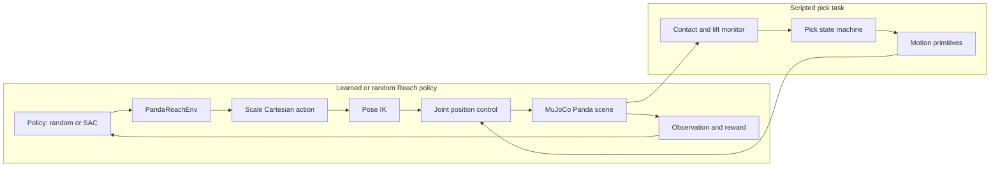

# Panda MuJoCo Manipulation

A reproducible MuJoCo project for learning robotic manipulation with the Franka Emika Panda robot.

This portfolio project covers joint-space control, end-effector control, inverse kinematics, grasping, testing, and experiment documentation.

## Current Status

- [x] Reproducible Python environment
- [x] Installable Python package
- [x] Headless MuJoCo environment check
- [x] Panda model integration
- [x] Reliable reset and home configuration
- [x] Joint-space position control
- [x] Gripper control and cube contact
- [x] End-effector control
- [x] Grasping task environment
- [x] Deterministic random-grasp evaluation

## Environment

- Python 3.10
- MuJoCo 3.12
- NumPy 2.2
- SciPy 1.15
- Tested on Windows with Python 3.10.21, MuJoCo 3.12.0, NumPy 2.2.6, and SciPy 1.15.3

## Installation

Create the Conda environment:

    conda env create -f environment.yml
    conda activate panda-mujoco

Install the package in editable mode:

    python -m pip install -e ".[dev]"

The optional Stable-Baselines3 dependency for SAC experiments can be installed with:

    python -m pip install -e ".[rl]"

GPU-enabled PyTorch is platform- and CUDA-specific. It is not required for the
core simulation, tests, or scripted grasp baseline.

## Quick Check

Run the headless environment check:

    python examples/check_environment.py

Expected final output:

    Simulation time: 2.0 s
    Ball height: 0.0496 m
    Environment check: PASSED

Run the automated test suite:

    python -m pytest -q

The Day 28 clean-environment check completed with 253 tests passed. Gymnasium
reported two advisory warnings because the continuous environment declares
unbounded observation-space limits (`-inf` and `+inf`). The observations in
the tested episodes were finite and passed the space checks.

Minimal scripted-pick environment example:

```python
from panda_mujoco.gym_env import PandaScriptedPickEnv

env = PandaScriptedPickEnv()
try:
    observation, info = env.reset(seed=42)
    observation, reward, terminated, truncated, info = env.step(1)
finally:
    env.close()
```

Action `1` runs the scripted pick episode. Action `0` waits for one environment
step. The five values returned by `step` follow the Gymnasium API.

## Architecture

The project keeps policy, task/environment logic, control, and physics in
separate layers. The scripted pick task and learned Reach policy share the
MuJoCo scene and robot-control components, but the Reach policy does not close
the gripper or perform a grasp.



## Week 2 Acceptance

Run the deterministic 50-target end-effector reach evaluation:

    python examples/day14/evaluate_reach.py

The current fixed-seed benchmark result is:

    IK success:                 50/50
    overall success:            50/50
    success rate:               100.00%
    mean successful error:      0.027230 mm
    maximum successful error:   0.098611 mm
    non-finite cases:           0
    joint-limit violations:     0
    Day 14 reach evaluation: PASSED

Per-target metrics are stored in:

    results/day14/reach_evaluation.csv

These results apply to the documented fixed target range, home initial
configuration, MuJoCo model, and ideal model-based bias compensation. They do
not claim full-workspace or real-robot performance.

## Week 3 Acceptance

Run the deterministic 20-episode random-grasp evaluation:

    python examples/day21/week3_acceptance.py

The current fixed-seed benchmark result is:

    success count:              20/20
    success rate:               100.00%
    minimum successful lift:    7.728 cm
    minimum successful hold:    0.500 s
    non-finite cases:           0
    joint-limit violations:     0
    terminated episodes:        20
    truncated episodes:         0
    Week 3 random-grasp acceptance: PASSED

Per-episode metrics are stored in:

    results/day21/grasp_evaluation.csv

Demonstration videos:

- [Successful scripted grasp](results/day21/videos/week3_success_seed00.mp4)
- [Injected contact-timeout failure](results/day21/videos/week3_failure_contact_timeout.mp4)

The failure video intentionally limits gripper closing to one physics step so
that `VERIFY_CONTACT` rejects the grasp. It is a state-machine diagnostic and
is not part of the 20-episode random benchmark.

These results apply only to seeds 0 through 19, the documented cube sampling
range, the bundled MuJoCo model, and ideal simulation conditions. They do not
establish full-workspace robustness or real-robot performance.

## Week 4: Gymnasium and SAC Reach baseline

Week 4 adds a Gymnasium-compatible interface, continuous Cartesian actions,
reward and termination logic, seeded evaluation, and random/scripted policy
baselines. The SAC experiment is a Reach-only study: the gripper stays open,
and the policy is not evaluated on contact, grasping, or lifting.

The 100k-step SAC checkpoint was evaluated on 10 held-out seeds, paired with a
random-action baseline under the same initial cube poses:

| Policy | Mean final position error | Mean final orientation error | Reach successes |
|---|---:|---:|---:|
| Random | 788.61 mm | 150.90° | 0/10 |
| SAC, 100k training steps | 85.99 mm | 72.53° | 0/10 |

SAC reduced the final errors on these 10 test seeds, but none of the episodes
met the defined Reach thresholds. This is preliminary evidence of useful
reaching behavior, not a converged policy or a broad generalization claim. It
does not demonstrate robotic grasping. See [the Day 27 experiment log](docs/day27_log.md)
and [the held-out evaluation results](results/day27/reach_final_test_100k.csv)
for the protocol and per-seed data.

The full local test suite currently contains 253 passing tests. Continuous
integration is configured in [`.github/workflows/ci.yml`](.github/workflows/ci.yml);
its remote status should be checked on GitHub before publishing a release.

## Model Assets

The Panda model assets are stored inside this repository at:

    assets/robots/panda/scene_with_cube.xml

The scene includes `panda.xml`, which loads mesh files from:

    assets/robots/panda/assets/

The original model license and source notes are preserved in:

    assets/robots/panda/LICENSE
    assets/robots/panda/README_original.md

Keeping the model inside the repository makes the project reproducible without relying on a local external model folder.


## Project Structure

    panda_mujoco_manipulation/
    ├── assets/
    │   ├── robots/panda/
    │   └── scenes/
    ├── configs/
    ├── docs/
    ├── examples/
    ├── results/
    ├── src/panda_mujoco/
    ├── tests/
    ├── environment.yml
    ├── LICENSE
    ├── pyproject.toml
    └── README.md

## Roadmap

### Week 1: Simulation Baseline

- Integrate and audit the Panda model
- Implement reliable reset and home configuration
- Implement joint-space control
- Verify gripper and cube contact

### Week 2: End-Effector Control

- Implement forward kinematics
- Implement Jacobian-based inverse kinematics
- Implement Cartesian pose control

### Week 3: Grasping Environment

- Implement reproducible cube resets and yaw-aligned grasp motion
- Add persistent-contact monitoring and a scripted pick state machine
- Evaluate the scripted grasp task over fixed and randomized seeds

### Week 4: Engineering and Portfolio

- Wrap the task in Gymnasium and validate the environment contract
- Compare random, scripted-expert, and Reach-only SAC baselines
- Document results and limitations, run tests/CI, and prepare a versioned release

## License

Except where otherwise noted, the original source code and documentation in
this repository are licensed under the [Apache License 2.0](LICENSE).

The bundled Franka Emika Panda model assets remain under their upstream
Apache License 2.0. Their license and original source notes are preserved in:

    assets/robots/panda/LICENSE
    assets/robots/panda/README_original.md
